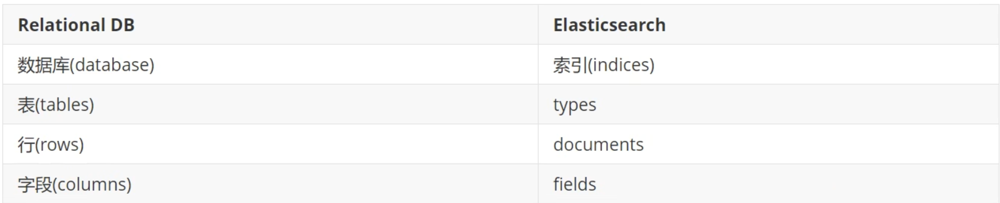
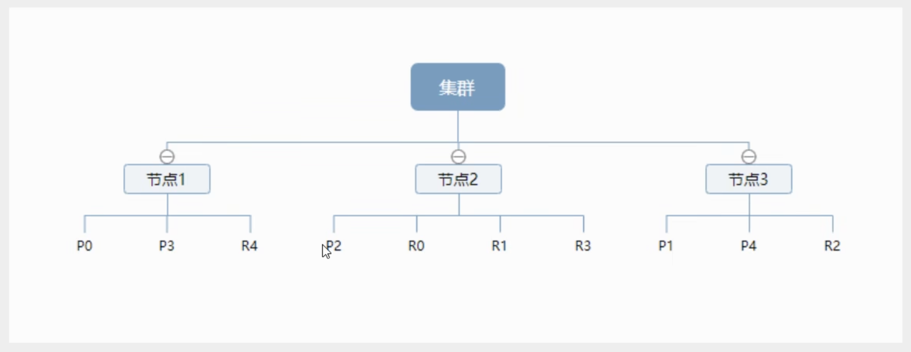
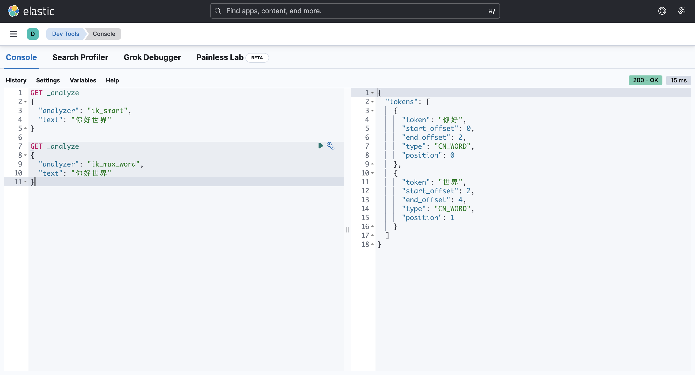
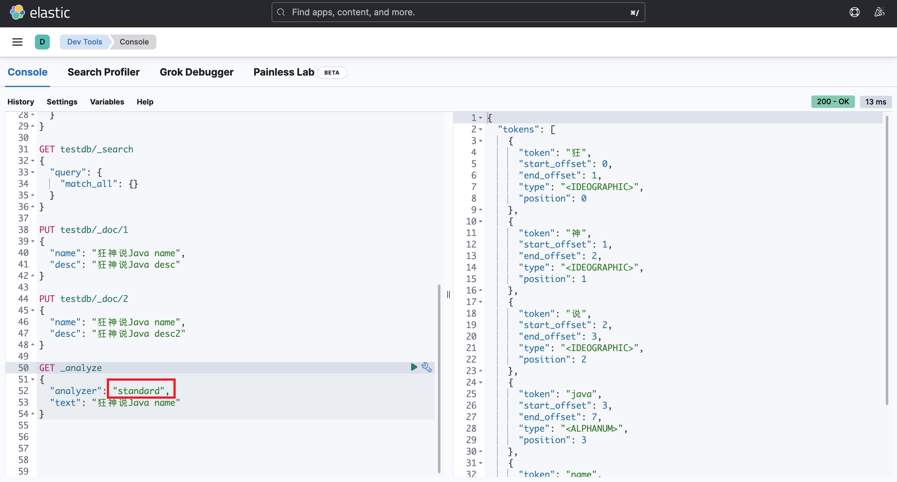
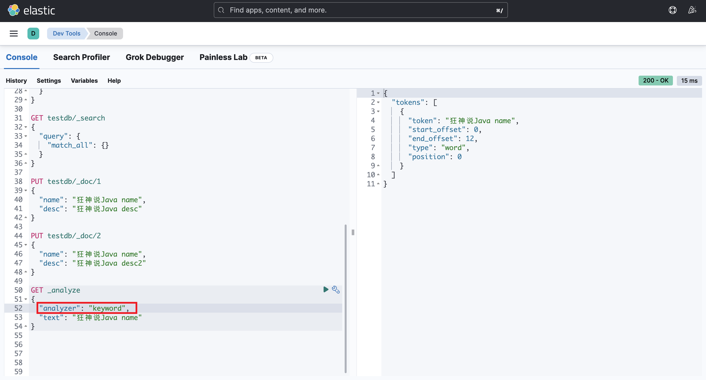
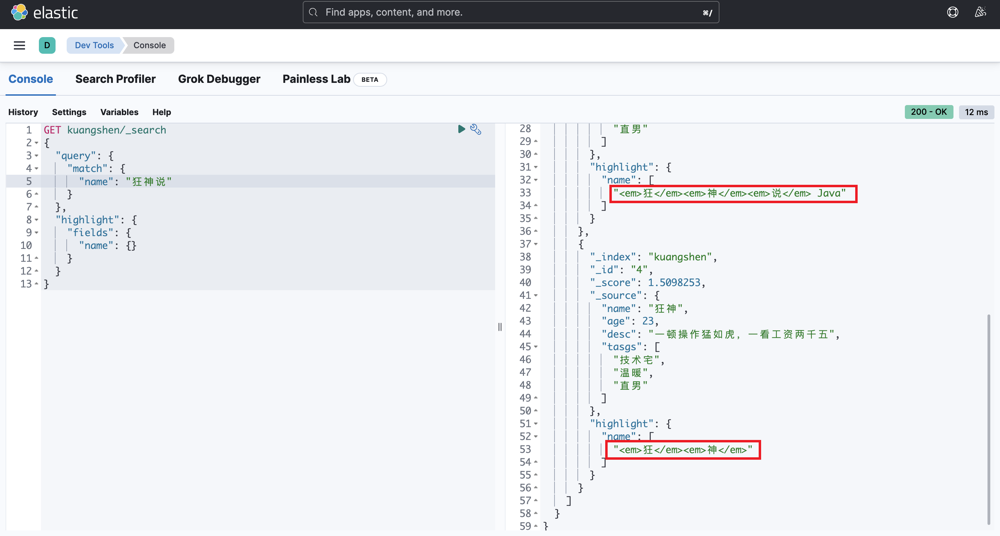

> 课程：[bilibili](https://www.bilibili.com/video/BV17a4y1x7zq/?spm_id_from=333.337.search-card.all.click&vd_source=734a4a3d12292363fc3078169ddd7db2)

# 诞生背景

## Lucene

`Lucene` 是一套信息检索工具包，jar 包，由 `Doug Cutting` 编写。它不包含搜索引擎系统，包含：

- 索引结构
- 读写索引工具
- 排序，搜索规则等工具类

Lucene 和 ElasticSearch 关系

ElasticSearch 是基于 Lucene 做了一些封装和增强，使上手变得十分简单

## ElasticSearch

一个叫做 `Shay Banon` 的刚结婚不就的实业开发者由于妻子要去伦敦学习初始，他便也跟着去了。在他找工作的过程中，为了给妻子构建一个食谱搜索引擎，他开始构建一个早期版本的 Lucene。直接基于 Lucene 工作会比较困难，所以 `Shay` 开始抽象 Lucene 代码以便 Java 程序员可以在应用中添加搜索功能，他发布了第一个开源项目，叫 `Compass`。后来他找到了一份工作，需要高性能、实时的、分布式的搜索引擎，然后他决定重写 `Compass` 库使其成为一个独立的服务叫做 `ElasticSearch`。

# ElasticSearch

## 概述

ES 是一个开源的高扩展的分布式全文检索引擎，它可以近乎实时的存储、检索数据，它使用 Java 开发并使用 Lucene 作为其核心来实现所有的索引和搜索功能，但它的目的是通过简单的 RESTful 来隐藏 Lucene 的复杂性，从而让全文搜索变得简单。

## ES 和 Solr 区别

- 当单纯对已有数据进行搜索时，Solr 更快
- 当实时建立索引时，Solr 会产生 IO 阻塞，查询性能较差，Elasticsearch 具有明显优势
- 随着数据量增加，Solr 的搜索效率会变得更低，而 Elasticsearch 没有明显变化


## 安装

熟悉目录

```shell
bin             # 启动文件
config          # 配置文件
    log4j2      # 日志配置文件
    jvm.options # java 虚拟机相关配置
    elasticsearch.yml # elasticsearch 的配置文件，默认 9200 端口，配置跨域
lib     # 相关 jar 包
modules # 功能模块
plugins # 插件
```

启动 Elasticsearch 之后访问 `localhost:9200`，可以得到一串 JSON 信息，代表成启动：

```json
{
  "name": "YuejiangdeAir.attlocal.net",
  "cluster_name": "elasticsearch",
  "cluster_uuid": "WSJBOQy9TfeMJhNZaQPGuA",
  "version": {
    "number": "8.6.2",
    "build_flavor": "default",
    "build_type": "tar",
    "build_hash": "2d58d0f136141f03239816a4e360a8d17b6d8f29",
    "build_date": "2023-02-13T09:35:20.314882762Z",
    "build_snapshot": false,
    "lucene_version": "9.4.2",
    "minimum_wire_compatibility_version": "7.17.0",
    "minimum_index_compatibility_version": "7.0.0"
  },
  "tagline": "You Know, for Search"
}
```

## 核心概念

Elasticsearch（集群）中可以包含多个索引（数据库），每个索引中可以包含多个文档（行），在 ES 7 及之前的版本中还有一个概念叫 type，类似与 MySQL 中的表，不过在 ES 8 中已经废弃。下表是 ES 与 MySQL 的概念类比以供参考：



### 物理设计

Elasticsearch 在后台把每个索引划分成多个分片，每个分片可以在集群中不同服务器间迁移，一个人就是一个集群，默认的集群名称是 `elasticsearch`

### 逻辑设计

#### 文档（document）

ES 是面向文档的，那么意味着索引和搜索数据的最小单位是文档。ES 中，文档有几个重要属性：

- 自我包含，一篇文档同时包含字段和对应的值，也就是同时包含 key 和 value
- 可以是层次型的，一个文档中包含其他文档（就是一个 JSON 对象）
- 灵活的结构，文档不依赖预先定义的模式，与关系数据库有很大的不同

#### 索引（index）

就是数据库，ES 中的索引是一个非常大的文档集合。索引存储了映射（mappings）和其它设置，它们被存储到了各个分片上

一个集群至少有一个节点，而一个节点就是一个 ES 进程，节点可以有多个索引。如果你创还能索引，默认情况下索引会有 5 个分片（primary shard，又称主分片）构成的，每一个主分片还会有一个副本（replica shard，又称复制分片）



上图是一个有 3 个节点的集群，可以看到主分片和对应的复制分片都不会再同一个节点内。实际上，一个分片是一个 Lucene 索引，一个包含倒排索引的文件目录。==所以一个 ES 索引是由多个 Lucene 索引组成的。==

#### 倒排索引（reverted index）

这种结构适用于快速的全文搜索。为了创建倒排索引，我们首先要将每个文档拆分成独立的词（或称为词条或者 tokens），然后穿件一个包含所有不重复词条的排序列表，然后列出每个词条出现在哪个文档，相当于我们构建了一个以关键词为 key，以文档编号为 value 的 map。在进行关键词搜索的时候，就可以很快地把对应的文档结果返回而不用遍历每一个文档的内容。

## IK 分词器

IK 分词器是一个常用的开源中文分词器，Github [地址](https://github.com/medcl/elasticsearch-analysis-ik)

安装命令：

```shell
elasticsearch-plugin install https://github.com/medcl/elasticsearch-analysis-ik/releases/download/v8.6.2/elasticsearch-analysis-ik-8.6.2.zip
```

需要注意的一点是，安装的插件版本一定要和自己电脑中的 ES 版本一致。也可以手动在 Release 页面中下载，解压缩后放入 ES 目录中的 `plugins` 目录下，但由于某些历史版本已经找不到了，所以建议用 `elaseicsearch-plugin` 命令直接下载

使用 IK 分词器的例子如下，其中 `ik_smart` 为最少切分，`ik_max_word` 为最细粒度切分，穷尽词库的可能



有时候可能分词结果不理想，我们可以自己对分词器的词典进行配置

## 查询

创建索引 / 插入数据

```json
PUT /kuangshen/_doc/1
{
  "name": "狂神说",
  "age": 23,
  "desc": "一顿操作猛如虎，一看工资两千五",
  "tasgs": ["技术宅", "温暖", "直男"]
}
```

查询

```json
GET kuangshen/_search
{
  "query": {
    "match": {
      "name": "狂神"
    }
  },
}
```

通过指定 `_source` 来自定义输出的 field

```json
GET kuangshen/_search
{
  "query": {
    "match": {
      "name": "狂神"
    }
  },
  "_source": ["name", "desc"]
}
```

通过指定 `sort` 来进行排序

```json
GET kuangshen/_search
{
  "query": {
    "match": {
      "name": "狂神"
    }
  },
  "sort": [
    {
      "age": {
        "order": "desc"
      }
    }
  ]
}
```

分页
通过指定 from 和 size 两个字段

```json
GET kuangshen/_search
{
  "query": {
    "match": {
      "name": "狂神"
    }
  },
  "sort": [
    {
      "age": {
        "order": "desc"
      }
    }
  ],
  "from": 0,
  "size": 2
}
```

布尔值查询

- `must` 类似于 AND 条件连接，列表中的所有条件都要符合
- `should` 类似于 OR 条件，列表中的条件满足其一即可
- `must_not` 类似于 NOT 操作

```json
GET kuangshen/_search
{
  "query": {
    "bool": {
      "must": [
        {
          "match": {
            "name": "狂神说Java"
          }
        },
        {
          "match": {
            "age": 23
          }
        }
      ]
    }
  }
}
```

过滤器 filter

使用 filter 进行数据的过滤，可以添加多个条件。下面的例子中要求返回的结果必须是 `age` 字段的值大于等于 10 但小于等于 30

- gt 大于
- gte 大于等于
- lt 小于
- lte 小于等于

```json
GET kuangshen/_search
{
  "query": {
    "bool": {
      "must": [
        {
          "match": {
            "name": "狂神"
          }
        }
      ],
      "filter": [
        {
          "range": {
            "age": {
              "gte": 10,
              "lte": 30
            }
          }
        }
      ]
    }
  }
}
```

多条件查询

多个条件可以使用空格隔开，只要满足其中一个结果即可以被查出

```json
GET kuangshen/_search
{
  "query": {
    "match": {
      "tags": "男 技术"
    }
  }
}
```

精确查询

term 查询时直接通过倒排索引指定的词条进程精确查找的

关于分词：

- `term`，直接查询精确的
- `match`，使用分词器解析（先分析文档，然后再通过分析的文档进行查询）

两个类型：text 和 keyword

`keyword` 不会被分词器解析

示例如下：

当我们使用 standard analyzer 的时候，要搜索的字符串会被拆分，然后针对每一个 token 进行搜索



但当我们使用 keyword 的时候就不会被拆分，而是将其视为一个整体进行查询



精确查询多个值

```json
GET testdb/_search
{
  "query": {
    "bool": {
      "should": [
        {
          "term": {
            "t1": 22
          }
        },
        {
          "term": {
            "t1": 33
          }
        }
      ]
    }
  }
}
```

高亮查询

```json
GET kuangshen/_search
{
  "query": {
    "match": {
      "name": "狂神"
    }
  },
  "highlight": {
    "fields": {
      "name": {}
    }
  }
}
```

在选择的高亮字段前后加入了 `<em>` 标签



我们也可以自定义高亮样式：

```json
GET kuangshen/_search
{
  "query": {
    "match": {
      "name": "狂神说"
    }
  },
  "highlight": {
    "pre_tags": "<p class='key' style='color:red'>",
    "post_tags": "</p>",
    "fields": {
      "name": {}
    }
  }
}
```

这样一来，查询结果的高亮字段前后就会从 `<em>` 变成我们自定义的 `<p>`
