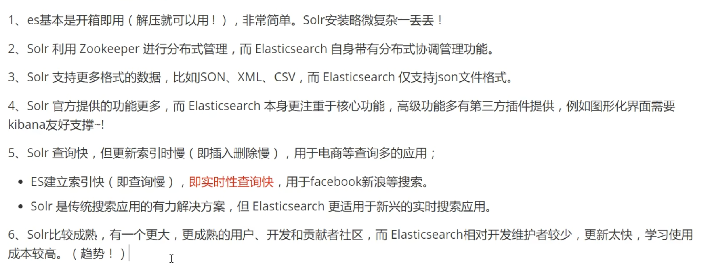

> 课程：[bilibili](https://www.bilibili.com/video/BV17a4y1x7zq/?spm_id_from=333.337.search-card.all.click&vd_source=734a4a3d12292363fc3078169ddd7db2)

# 诞生背景

## Lucene

`Lucene` 是一套信息检索工具包，jar 包，由 `Doug Cutting` 编写。它不包含搜索引擎系统，包含：

- 索引结构
- 读写索引工具
- 排序，搜索规则等工具类

Lucene 和 ElasticSearch 关系

ElasticSearch 是基于 Lucene 做了一些封装和增强，使上手变得十分简单

## ElasticSearch

一个叫做 `Shay Banon` 的刚结婚不就的实业开发者由于妻子要去伦敦学习初始，他便也跟着去了。在他找工作的过程中，为了给妻子构建一个食谱搜索引擎，他开始构建一个早期版本的 Lucene。直接基于 Lucene 工作会比较困难，所以 `Shay` 开始抽象 Lucene 代码以便 Java 程序员可以在应用中添加搜索功能，他发布了第一个开源项目，叫 `Compass`。后来他找到了一份工作，需要高性能、实时的、分布式的搜索引擎，然后他决定重写 `Compass` 库使其成为一个独立的服务叫做 `ElasticSearch`。

# ElasticSearch

## 概述

ES 是一个开源的高扩展的分布式全文检索引擎，它可以近乎实时的存储、检索数据，它使用 Java 开发并使用 Lucene 作为其核心来实现所有的索引和搜索功能，但它的目的是通过简单的 RESTful 来隐藏 Lucene 的复杂性，从而让全文搜索变得简单。

## ES 和 Solr 区别

- 当单纯对已有数据进行搜索时，Solr 更快
- 当实时建立索引时，Solr 会产生 IO 阻塞，查询性能较差，Elasticsearch 具有明显优势
- 随着数据量增加，Solr 的搜索效率会变得更低，而 Elasticsearch 没有明显变化



## 安装

熟悉目录

```shell
bin             # 启动文件
config          # 配置文件
    log4j2      # 日志配置文件
    jvm.options # java 虚拟机相关配置
    elasticsearch.yml # elasticsearch 的配置文件，默认 9200 端口，跨域
lib     # 相关 jar 包
modules # 功能模块
plugins # 插件
```

启动 Elasticsearch 之后访问 `localhost:9200`，可以得到一串 JSON 信息，代表成启动：

```json
{
  "name": "YuejiangdeAir.attlocal.net",
  "cluster_name": "elasticsearch",
  "cluster_uuid": "WSJBOQy9TfeMJhNZaQPGuA",
  "version": {
    "number": "8.6.2",
    "build_flavor": "default",
    "build_type": "tar",
    "build_hash": "2d58d0f136141f03239816a4e360a8d17b6d8f29",
    "build_date": "2023-02-13T09:35:20.314882762Z",
    "build_snapshot": false,
    "lucene_version": "9.4.2",
    "minimum_wire_compatibility_version": "7.17.0",
    "minimum_index_compatibility_version": "7.0.0"
  },
  "tagline": "You Know, for Search"
}
```
