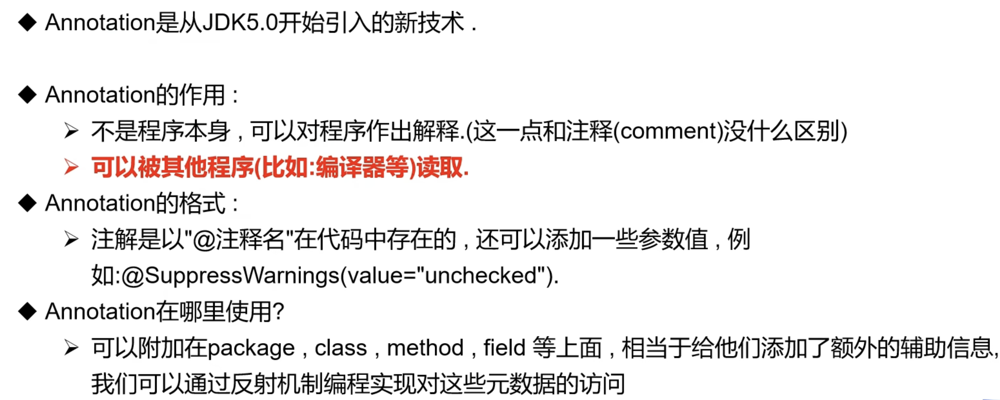

> 课程链接：[bilibili](https://www.bilibili.com/video/BV1p4411P7V3/?vd_source=734a4a3d12292363fc3078169ddd7db2)

# 注解

## 什么是注解

## 内置注解

以下是三个最常用的内置注解

- @Override：重写被修饰的方法
- @Deprecated：修饰的方法已经废弃不推荐使用
- @SuppressWarnings：用来抑制编译时的警告信息

## 元注解

负责注解其他注解的注解，Java 定义了 4 个标准的 meta-annotation 类型，他们被用来提供对其他 annotation 类型作说明：

- @Target：用于描述注解的使用范围（方法？构造器？类？）
- @Retention：表示需要再什么级别保存该注释信息，用于描述注解的生命周期（SOURCE？CLASS？RUNTIME？），一般都是 RUNTIME
- @Document：说明该注解将被包含在 javadoc 中
- @Inherited：说明子类可以继承父类中的注解